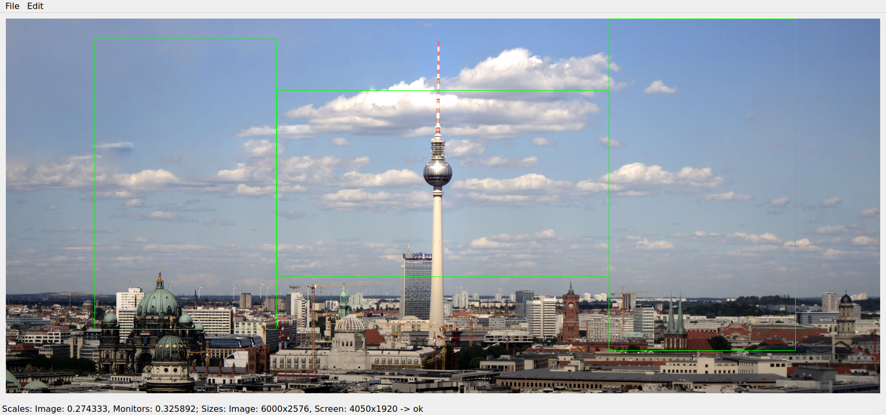

# Desktop Cropper 2
This Qt application can be used to crop a background image into multiple parts. I wrote it because i could not find another way to use connected background images with xfce.

# UI

Left Screen Result             |  Middle Screen Result | Right Screen Result
:-------------------------:|:-------------------------:
 |  | 
